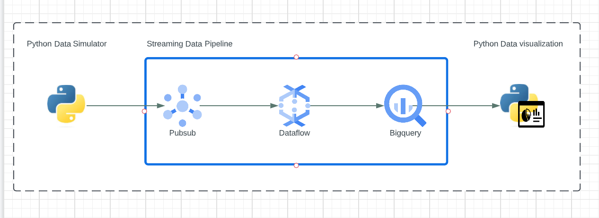

# Real Time Visibility - Anomaly Detection

Demo Asset for Anomaly Detection Use case RealTime Intelligence Go To Market Sales Play 

## About this Lab

Anomaly Detection is a demo to show an end to end architecture of a streaming pipeline from raw data ingestion to transform the data using Dataflow - leveraging Dataflow notebooks, setting up an Apache Beam pipeline, transforming the data using Windows and finally landing the data in BigQuery for further analysis. Below you will find an architecture diagram of the overall end to end solution

## Architecture 

## Lab Modules 

This repo is organized across various modules:

[1. Prerequisites - provisioning, configuring, securing](01-Prerequisites.md)  
[2. Data Generation](02-PythonSimulationScript.md)  
[3. Data Integration Pipeline](03-DataflowNotebook.md)  

## Credits

Authors: Smitha Venkat, Google Cloud & Purnima Maganti, Google Cloud 