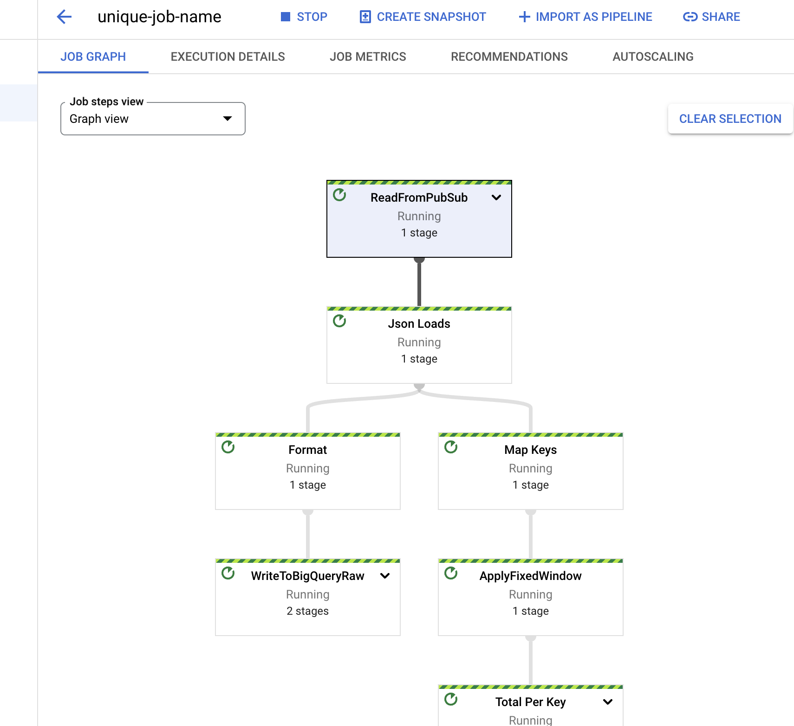

# About

This module includes setting up the data pipeline to ingest data that is flowing into the pub-sub topic, set up the Apache Beam Pipeline to run with Dataflow runner, push the raw data to BigQuery Raw Tables and aggregate using windowing functions in the beam pipeline to push it to a aggregated table for further analysis. <br>

## 1. Variables

Run the below in cloud shells to define variables -
```
DEST_PROJECT=`gcloud config get-value project`
VPC=$DEST_PROJECT"-vpc"
SUBNET=$VPC"-subnet"
REGION=us-central1
VPC_FQN=projects/$DEST_PROJECT/global/networks/$VPC

SERVICE_ACCOUNT=<Insert your service account id>
SERVICE_ACCOUNT_FQN=$SERVICE_ACCOUNT@$DEST_PROJECT.iam.gserviceaccount.com
BQ_DATASET=anomaly_detection

PUBSUB_SUBSCRIPTION=manufacturing_anomaly_topic-sub
BQ_SCHEMA="sensorID:STRING,sensorValue:FLOAT,windowStart:DATETIME,windowEnd:DATETIME"
BIGQUERY_RAW_SCHEMA = "sensorID:STRING,timeStamp:DATETIME,sensorValue:FLOAT"

BUCKET_NAME=$DEST_PROJECT"-bucket"

BIGQUERY_RAW_TABLE=DEST_PROJECT.BQ_DATASET.anomaly_raw_table
BIGQUERY_AGG_TABLE = DEST_PROJECT.BQ_DATASET.anomaly_windowed_table
```

## 2. Big Query Dataset and Table 

#### 1. Create Big Query Dataset <br>

```
bq --location=$REGION mk \
--dataset \
$DEST_PROJECT:$BQ_DATASET
```

#### 2. Create a Table in the Dataset<br>

```
bq mk \
--table \
$DEST_PROJECT:$BQ_DATASET.$BQ_TABLE \
sensorID:STRING,sensorValue:FLOAT,windowStart:DATETIME,windowEnd:DATETIME
```
#### 3. Create a storage bucket 

Run the below command in cloud shell

```
gsutil mb -c standard -l $REGION gs://$BUCKET_NAME/tmp
```
#### 4. Run the below commands in the notebook your created in the prerequisite step

##### 1. Import Modules 

```
#!/usr/bin/env python
import argparse
import json
import os
import logging
import apache_beam as beam
from datetime import datetime
from apache_beam import DoFn
from apache_beam.options.pipeline_options import PipelineOptions, StandardOptions
from apache_beam import DoFn, GroupByKey, io, ParDo, Pipeline, PTransform, WindowInto, WithKeys,Create,Map , CombineGlobally ,dataframe
from apache_beam import CombineGlobally, CombinePerKey
from apache_beam.runners.interactive import interactive_runner
logging.basicConfig(level=logging.INFO)
logging.getLogger().setLevel(logging.INFO)
```

##### 2. Add Window Starttime and Endtime to PCollections after the window aggregation

```
class FormatDoFn(beam.DoFn):
    def process(self, element, window=beam.DoFn.WindowParam):
        ts_format = '%Y-%m-%d %H:%M:%S.%f UTC'
        window_start = datetime.fromtimestamp(window.start)
        window_end = datetime.fromtimestamp(window.end)
        return [{
        'sensorID': element[0],
        'sensorValue': element[1],
        'windowStart': window_start,
        'windowEnd': window_end
        }]
```
##### 3. Add Window Starttime and Endtime to PCollections after the window aggregation

```
class ProcessDoFn(beam.DoFn):
    def process(self, element):
        yield element
```
##### 4. Build Pipeline with Dataflow Runner 

```
def run(runneroption):
    # Parsing arguments
    parser = argparse.ArgumentParser()
    parser.add_argument(
        "--input_subscription",
        help='Input PubSub subscription of the form "projects/<PROJECT>/subscriptions/<SUBSCRIPTION>."',
        default=PUBSUB_SUBSCRIPTION,
    )
    parser.add_argument(
        "--output_raw_table", help="Output BigQuery Table", default=BIGQUERY_RAW_TABLE
    )
    parser.add_argument(
        "--output_agg_table", help="Output BigQuery Table", default=BIGQUERY_AGG_TABLE
    )
    parser.add_argument(
        "--output_raw_schema",
        help="Output BigQuery Schema in text format",
        default=BIGQUERY_RAW_SCHEMA,
    )
    parser.add_argument(
        "--output_schema",
        help="Output BigQuery Schema in text format",
        default=BIGQUERY_SCHEMA,
    )
    known_args, pipeline_args = parser.parse_known_args()

    
    if runneroption == 'DataflowRunner':
        pipeline_options = PipelineOptions(
        pipeline_args,
        runner=runneroption,
        project=DEST_PROJECT,
        job_name='unique-job-name',
        temp_location=BUCKET_NAME,
        region=REGION,
        service_account_email=SERVICE_ACCOUNT_FQN,
        network=VPC_FQN,
        subnetwork=SUBNET)
    else:
        pipeline_options = PipelineOptions(
        pipeline_args,
        runner=runneroption)
    pipeline_options.view_as(StandardOptions).streaming = True
        
    with beam.Pipeline(options=pipeline_options) as p:
    
            mapped =     (
                
                p
                  | "ReadFromPubSub" >> beam.io.gcp.pubsub.ReadFromPubSub(subscription=PUBSUB_SUBSCRIPTION)
                  | "Json Loads" >> Map(json.loads))
            raw_data = (
                mapped             
                        
                  | 'Format' >> beam.ParDo(ProcessDoFn())
                  |  "WriteToBigQueryRaw" >> beam.io.WriteToBigQuery(
                known_args.output_raw_table,
                schema=known_args.output_raw_schema,
                write_disposition=beam.io.BigQueryDisposition.WRITE_APPEND))
            agg_data = (mapped
                        
                  | "Map Keys" >> Map(lambda x: (x["SensorID"],x["SensorValue"]))
                  | "ApplyFixedWindow" >> beam.WindowInto(beam.window.FixedWindows(3))
                  | "Total Per Key" >> beam.combiners.Mean.PerKey()
                  | 'Final Format' >> beam.ParDo(FormatDoFn())
                  |  "WriteToBigQuery" >> beam.io.WriteToBigQuery(
                known_args.output_agg_table,
                schema=known_args.output_schema,
                write_disposition=beam.io.BigQueryDisposition.WRITE_APPEND
            ))
```

##### 4. Run the Pipeline  
Run the pipeline with options a. DirectRunner
                              b. DataflowRunner

```
if __name__ == "__main__":
  run(runneroption ="dataflowrunner")
```

#### 5. Above step should create a dataflow job that will look like this 



#### 6. Run the python simulator
This simulator will generate a message per every millisecond until it reaches 5000 messages.
```
if __name__ == "__main__":
    simulator(5000)
```
#### 7. Check data in BigQuery Table

The above step will create two tables in BigQuery - Raw table and Aggregated table

Raw Table will have the raw data written direcly from a pub sub topic 

Raw Schema - 


Raw Data - 


Aggregated Table will have the windowed data every 10 seconds. 

Aggregate Table Schema - 


Aggregate Table Data - 


#### 8. Visualize Anomaly Data 

Visualize data with matplot lib. 


